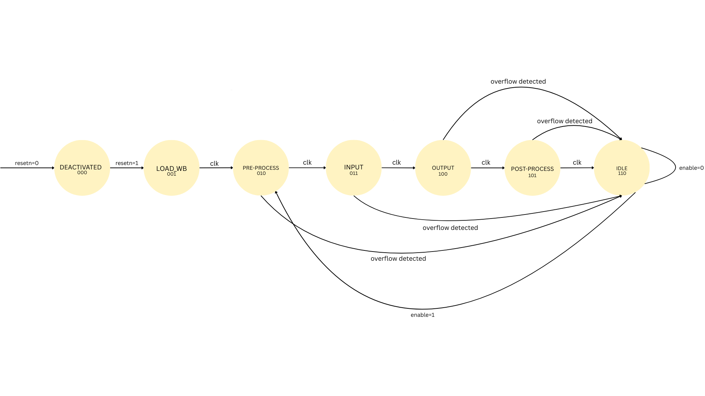

# HARDWARE-1: Αναφορά Εργαρίας

Αυτή η αναφορά περιλαμβάνει την περιγραφή και υλοποίηση των ασκήσεων που ανατέθηκαν στο πλαίσιο του μαθήματος `Ψηφιακά Συστήματα HW σε Χαμηλά Επίπεδα Λογικής Ι`. Κάθε άσκηση συνοδεύεται από ανάλυση του κώδικα, διαγράμματα και αποτελέσματα προσομοιώσεων.

- **Άσκηση 1:** Υλοποίηση ενός module `alu` που εκτελεί βασικές αριθμητικές και λογικές λειτουργίες.
- **Άσκηση 2:** Δημιουργία αριθμομηχανής με χρήση της `ALU` και συνδυαστικής λογικής.
- **Άσκηση 3:** Σχεδίαση ενός `register file` με πολλαπλές θύρες ανάγνωσης και εγγραφής.
- **Άσκηση 4:** Υλοποίηση ενός νευρωνικού δικτύου για επεξεργασία δεδομένων.

Η αναφορά περιλαμβάνει επίσης διαγράμματα, waveforms και πίνακες που τεκμηριώνουν τη λειτουργία των υλοποιήσεων.

## Άσκηση 1: Υλοποίηση `ALU`

Σε αυτήν την άσκηση υλοποιήθηκε ένα module `alu`, το οποίο πραγματοποιεί διάφορες αριθμητικές και λογικές πράξεις. Οι διαφορετικές λειτουργίες της μονάδας ορίστηκαν ως παράμετροι, όπως φαίνεται παρακάτω:

```verilog
  parameter [3:0] ALU_AND = 4'b1000;
  parameter [3:0] ALU_OR = 4'b1001;
  parameter [3:0] ALU_NOR = 4'b1010;
  parameter [3:0] ALU_NAND = 4'b1011;
  parameter [3:0] ALU_XOR = 4'b1100;
  parameter [3:0] ALU_ADD = 4'b0100;
  parameter [3:0] ALU_SUB = 4'b0101;
  parameter [3:0] ALU_MUL = 4'b0110;
  parameter [3:0] ALU_LOG_SHIFT_R = 4'b0000;
  parameter [3:0] ALU_LOG_SHIFT_L = 4'b0001;
  parameter [3:0] ALU_ARI_SHIFT_R = 4'b0010;
  parameter [3:0] ALU_ARI_SHIFT_L = 4'b0011;
```

Η υλοποίηση των πράξεων έγινε μέσα σε ένα `always` block, χρησιμοποιώντας την εντολή `case` για την επιλογή της κατάλληλης πράξης, με βάση το σήμα ελέγχου `alu_op`.

## Άσκηση 2: Δημιουργία Αριθμομηχανής

Στην άσκηση αυτή, δημιουργήθηκε μια αριθμομηχανή που χρησιμοποιεί την `ALU` για την εκτέλεση αριθμητικών πράξεων. Η αριθμομηχανή δέχεται δύο εισόδους και ένα σήμα ελέγχου για να καθορίσει την πράξη που θα εκτελεστεί. Σε αυτήν την άσκηση, υλοποιήθηκαν τα παρακάτω αρχεία: `calc.v`, `calc_enc.v`, και `tb_calc.v`.

`calc_enc.v`

Το αρχείο `calc_enc.v` περιέχει τη συνδυαστική λογική που παράγει το σήμα `alu_op`. Το σήμα αυτό είναι 4-bit που καθορίζει τη λειτουργία της μονάδας `ALU`, με βάση τις εισόδους `btnc`, `btnr`, και `btnl`.

Η σχεδίαση βασίστηκε στη χρήση πυλών `AND`, `OR`, `NOT` και `XOR`. Κάθε bit του `alu_op` υπολογίζεται μέσω συγκεκριμένων συνδυασμών των εισόδων.

`calc.v`

Στο αρχείο `calc.v` υλοποιείται μια αριθμομηχανή, η οποία ενσωματώνει τις λειτουργίες της μονάδας `ALU` και της λογικής κωδικοποίησης από το `calc_enc.v`. Η αριθμομηχανή δέχεται ως εισόδους διάφορα πλήκτρα (buttons), διακόπτες για την εισαγωγή δεδομένων `sw`, και το ρολόι (`clk`), ενώ παρέχει ως έξοδο το σήμα `led`.

**Βασική Υλοποίηση**

- **Δημιουργία Instances**:
    - `alu` για αριθμητικές και λογικές πράξεις.
    - `calc_enc.v` για τον προσδιορισμό του `alu_op`.
- **Είσοδοι και Σήματα**:
    - `signal_op1` και `signal_op2` αντιστοιχίζονται στον accumulator και τους διακόπτες `sw`.
    - Το `led` εμφανίζει την τρέχουσα τιμή του accumulator.
- **Λογική Λειτουργία**:
    - Το `accumulator` ανανεώνεται σε `always` block στην ακμή του `clk`.
    - Αν `btnu` πατηθεί, το `accumulator` μηδενίζεται.
    - Αν `btnd` πατηθεί, το αποτέλεσμα της `ALU` αποθηκεύεται στο `accumulator`.

`calc_tb.v`

Για την επαλήθευση της λειτουργίας της αριθμομηχανής, υλοποιήθηκε testbench (`calc_tb.v`), στο οποίο παράγεται σήμα ρολογιού, εφαρμόζεται σύγχρονη επαναφορά και προσομοιώνονται διαδοχικές λειτουργίες της `ALU` μέσω των σημάτων ελέγχου. Το testbench ελέγχει βασικές αριθμητικές και λογικές πράξεις συγκρίνοντας την έξοδο led με τις αναμενόμενες τιμές, ενώ παράλληλα καταγράφονται κυματομορφές σε αρχείο VCD για περαιτέρω ανάλυση.

**Αποτελέματα**

Δοκιμάστηκαν διάφορες λειτουργίες της αριθμομηχανής, όπως η πρόσθεση, αφαίρεση, πολλαπλασιασμός, λογικές πράξεις (`AND`, `OR`, `XOR`, `NAND`, `NOR`), καθώς και λογικές και αριθμητικές μετατοπίσεις. Όλες οι τιμές που προέκυψαν από τις δοκιμές ήταν οι αναμενόμενες, επιβεβαιώνοντας τη σωστή λειτουργία του σχεδιασμού.

**Εικόνα Εξόδου (Waveform)**

Παρατίθεται η εικόνα της παραγόμενης waveform για την προσομοίωση που πραγματοποιήθηκε κατά τη διάρκεια των δοκιμών.


# Άσκηση 3: Υλοποίηση Register File

Το αρχείο `regfile.v` υλοποιεί ένα αρχείο καταχωρητών 16×32-bit με τέσσερις θύρες ανάγνωσης και δύο θύρες εγγραφής, σύμφωνα με τις απαιτήσεις της άσκησης. Η λειτουργία του διαχωρίζεται σε δύο `always` blocks με διακριτό ρόλο:

- **Clocked always block (εγγραφή και επαναφορά):**

    - Υλοποιεί την ασύγχρονη επαναφορά ενεργή σε χαμηλό επίπεδο (`resetn`), η οποία μηδενίζει όλους τους καταχωρητές.
    - Πραγματοποιεί την εγγραφή δεδομένων στους καταχωρητές κατά την ανερχόμενη ακμή του ρολογιού, όταν το σήμα `write` είναι ενεργό.
    - Υποστηρίζει δύο ταυτόχρονες εγγραφές μέσω των σημάτων `writeReg1`/`writeData1` και `writeReg2`/`writeData2`.

- **Combinational always block (ανάγνωση και προτεραιότητα εγγραφής):**

    - Παρέχει συνδυαστική ανάγνωση των καταχωρητών που υποδεικνύονται από τα σήματα `readReg1` έως `readReg4`.
    - Αναθέτει άμεσα τις τιμές των επιλεγμένων καταχωρητών στις εξόδους `readData1` έως `readData4`, χωρίς τη χρήση ρολογιού.
    - Περιλαμβάνει μηχανισμό write-forwarding, ο οποίος δίνει προτεραιότητα στα δεδομένα εγγραφής όταν υπάρχει ταυτόχρονη εγγραφή και ανάγνωση του ίδιου καταχωρητή, εξασφαλίζοντας ότι επιστρέφεται η πιο πρόσφατη τιμή.

Η παραπάνω υλοποίηση επιτρέπει αξιόπιστη και συνεπή πρόσβαση στα δεδομένα των καταχωρητών, ακόμα και σε περιπτώσεις ταυτόχρονης εγγραφής και ανάγνωσης, και είναι κατάλληλη για χρήση στα επόμενα στάδια του συστήματος.

# Άσκηση 4: Υλοποίηση Νευρωνικού Δικτύου

Στην Άσκηση 4 υλοποιήθηκε ένα απλό νευρωνικό δίκτυο βασισμένο σε πεπερασμένη μηχανή καταστάσεων τύπου **Moore**. Η `FSM` ελέγχει τη ροή των υπολογισμών χρησιμοποιώντας μονάδες `MAC` για την επεξεργασία των δεδομένων. Η υλοποίηση επαληθεύτηκε μέσω προσομοίωσης και ανάλυσης κυματομορφών.

**FSM States**

```verilog
S_DEACTIVATED: begin
    if (enable && resetn)
        next_state = S_LOAD_WB;
end

S_LOAD_WB: begin
    write = 1'b1;
    writeReg1 = rom_target_reg;
    writeData1 = rom_data;

    if (weight_loaded)
        next_state = S_PREPROCESS;
end

S_PREPROCESS: begin
    // Read shift biases
    readReg1 = 4'h2;  // shift_bias_1
    readReg2 = 4'h3;  // shift_bias_2
    next_state = S_INPUT;
end

S_INPUT: begin
    // Read weights and biases for input layer
    readReg1 = 4'h4;  // weight_1
    readReg2 = 4'h5;  // bias_1
    readReg3 = 4'h6;  // weight_2
    readReg4 = 4'h7;  // bias_2

    // CHECK FOR OVERFLOW - jump to IDLE immediately if detected
    if (ovf_input_stage)
        next_state = S_IDLE;
    else
        next_state = S_OUTPUT;
end

S_OUTPUT: begin
    // Read weights and bias for output layer
    readReg1 = 4'h8;  // weight_3
    readReg2 = 4'h9;  // weight_4
    readReg3 = 4'hA;  // bias_3
    readReg4 = 4'hB;  // shift_bias_3 (will be latched for POST)

    // CHECK FOR OVERFLOW - jump to IDLE immediately if detected
    if (ovf_output_stage)
        next_state = S_IDLE;
    else
        next_state = S_POST;
end

S_POST: begin
    // shift_bias_3_reg already contains the shift value
    next_state = S_IDLE;
end

S_IDLE: begin
    if (enable)
        next_state = S_PREPROCESS;
end
```

**Διάγραμμα FSM**



`tb_nn.v`

Για την επαλήθευση της λειτουργίας του νευρωνικού δικτύου υλοποιήθηκε testbench (`tb_nn.v`), στο οποίο παράγεται σήμα ρολογιού και εφαρμόζονται τα κατάλληλα σήματα επαναφοράς και ενεργοποίησης. Μέσω της προσομοίωσης παρακολουθήθηκε η ακολουθία των καταστάσεων της `FSM`, η ορθή φόρτωση των δεδομένων και η παραγωγή της τελικής εξόδου. Οι κυματομορφές που προέκυψαν επιβεβαιώνουν τη σωστή και συγχρονισμένη λειτουργία του συστήματος.

**Εικόνα Εξόδου (Waveform)**


